# Miami Theater Voice Agent - System Architecture

```mermaid
graph TB
    %% External Systems
    User[👤 User]
    ElevenLabs[🎤 ElevenLabs Voice Agent]
    AgileWS[🎬 Agile WebSales API<br/>O Cinema Data]
    VercelCron[⏰ Vercel Cron Jobs]

    %% Core Infrastructure
    subgraph "Vercel Platform"
        subgraph "API Endpoints"
            ShowtimesAPI[📋 /api/showtimes<br/>Query Interface]
            CronAPI[🔄 /api/cron/ingest-showtimes<br/>Data Ingestion]
        end

        subgraph "Serverless Functions"
            ShowtimeHandler[🔍 Showtime Handler<br/>- Query Processing<br/>- Data Filtering<br/>- Voice Optimization]
            CronHandler[📥 Cron Handler<br/>- Data Fetching<br/>- Processing<br/>- Caching]
        end
    end

    subgraph "Data Layer"
        UpstashRedis[(🗄️ Upstash Redis<br/>Serverless Cache)]
        CachedData[📊 Cached Data<br/>- movies<br/>- by_date<br/>- weekend<br/>- upcoming]
    end

    subgraph "ElevenLabs Integration"
        WebhookTool[🔧 Webhook Tool<br/>Miami-Theater-Showtimes]
        ConvAgent[🤖 Conversational Agent<br/>Voice Interface]
        SetupScript[⚙️ Setup Scripts<br/>Python & Node.js]
    end

    %% User Interaction Flow
    User -->|Voice Commands| ElevenLabs
    ElevenLabs -->|Natural Language| ConvAgent
    ConvAgent -->|API Calls| WebhookTool
    WebhookTool -->|HTTP GET| ShowtimesAPI

    %% API Processing
    ShowtimesAPI --> ShowtimeHandler
    ShowtimeHandler -->|Query Cache| UpstashRedis
    UpstashRedis -->|Return Data| ShowtimeHandler
    ShowtimeHandler -->|Voice-Optimized Response| WebhookTool
    WebhookTool -->|Structured Data| ConvAgent
    ConvAgent -->|Text-to-Speech| ElevenLabs
    ElevenLabs -->|Voice Response| User

    %% Data Ingestion Flow
    VercelCron -->|Every 30 min| CronAPI
    CronAPI --> CronHandler
    CronHandler -->|Fetch Shows| AgileWS
    AgileWS -->|Raw JSON| CronHandler
    CronHandler -->|Process & Transform| CachedData
    CachedData -->|Store with TTL| UpstashRedis

    %% Setup Flow
    SetupScript -.->|Create Tool| WebhookTool
    SetupScript -.->|Create Agent| ConvAgent
    SetupScript -.->|Link Tool| ConvAgent

    %% Styling
    classDef external fill:#e1f5fe,stroke:#0277bd,stroke-width:2px
    classDef vercel fill:#f3e5f5,stroke:#7b1fa2,stroke-width:2px
    classDef data fill:#e8f5e8,stroke:#388e3c,stroke-width:2px
    classDef elevenlabs fill:#fff3e0,stroke:#f57c00,stroke-width:2px

    class User,AgileWS,VercelCron external
    class ShowtimesAPI,CronAPI,ShowtimeHandler,CronHandler vercel
    class UpstashRedis,CachedData data
    class ElevenLabs,WebhookTool,ConvAgent,SetupScript elevenlabs
```

## Component Descriptions

### External Systems
- **User**: End users interacting via voice commands
- **ElevenLabs Voice Agent**: AI-powered conversational interface
- **Agile WebSales API**: Source of O Cinema theater data
- **Vercel Cron Jobs**: Automated scheduling system

### Core API Layer
- **Showtimes API**: Main query endpoint with CORS for voice agent integration
- **Cron API**: Secured data ingestion endpoint with bearer token authentication
- **Serverless Functions**: Request handlers optimized for voice interaction

### Data Management
- **Upstash Redis**: Serverless cache with 2-hour TTL
- **Cached Data**: Structured data optimized for voice queries (movies, by_date, weekend, upcoming)

### Voice Integration
- **Webhook Tool**: ElevenLabs tool configuration pointing to Vercel API
- **Conversational Agent**: Voice-optimized AI with theater domain knowledge
- **Setup Scripts**: Automated configuration for tool and agent creation

## Data Flow Patterns

1. **Voice Interaction**: User → ElevenLabs → Conversational Agent → Webhook Tool → API → Cache → Response
2. **Data Ingestion**: Cron → API → Agile WebSales → Processing → Cache Storage
3. **Setup Process**: Scripts → Tool Creation → Agent Creation → Tool Linking

## Key Features

- **Voice-Optimized Responses**: Summary fields formatted for text-to-speech
- **Intelligent Caching**: 30-minute ingestion with 2-hour cache TTL
- **Natural Language Processing**: Automatic mapping of conversational queries to API parameters
- **Dual Implementation**: Both Python and Node.js setup options
- **Development Fallbacks**: Mock data when Redis unavailable